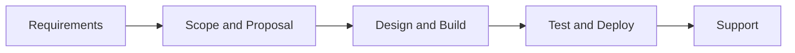

# Mission, Vision & Values

## Mission

To transform business ideas into reliable digital products through clear requirements, disciplined engineering, secure development, and transparent delivery.

## Vision

To become a trusted technology partner for startups and growing businesses across Pakistan, Egypt, and international markets.

## Core values

| Value | What it means in practice |
|-------|---------------------------|
| Written requirements first | No coding before scope is documented |
| Clear scope before pricing | Milestones and pricing tied to defined deliverables |
| Secure engineering | Secrets in env vars; HTTPS; hardened auth |
| Honest communication | Early blockers, realistic timelines |
| Transparent delivery | GitHub-based workflow clients can follow |
| Long-term trust | Support and maintenance after launch |
| Practical solutions | Right-sized tech, not over-engineering |

## How we work (5 steps)

1. **Requirement collection** — goals, features, constraints in writing  
2. **Scope & proposal** — milestones, timeline, pricing  
3. **Design & development** — UI/UX, engineering, updates  
4. **Testing & deployment** — QA, security checks, production  
5. **Support & maintenance** — post-launch improvements  

## Related docs

- [Services catalog](SERVICES_CATALOG.md)  
- [Company overview](COMPANY_OVERVIEW.md)
