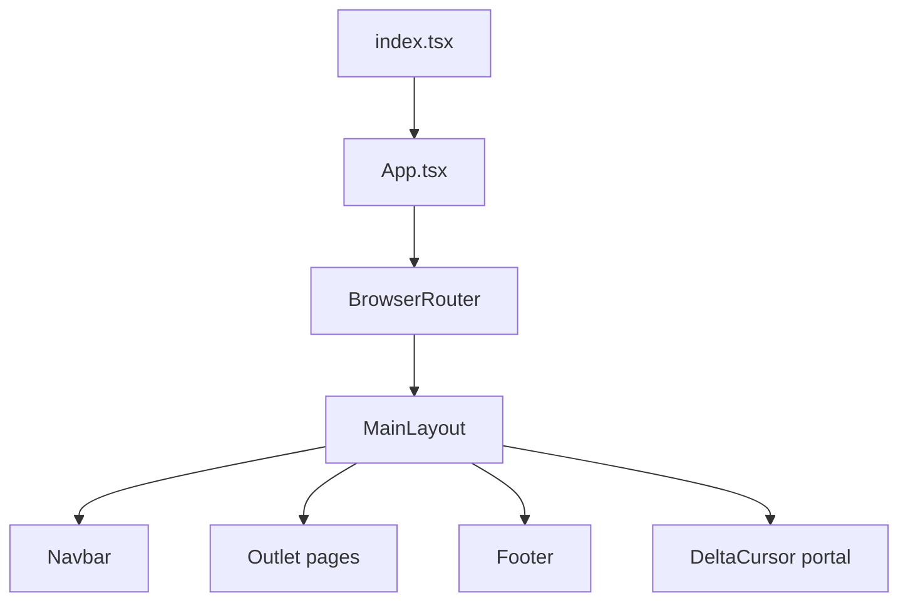
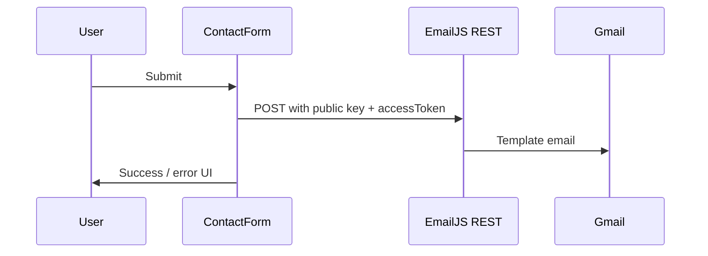

# Architecture & Routes

## High-level structure



## Key directories

```
src/
├── App.tsx                 # Route definitions
├── layouts/MainLayout.tsx  # Shell: nav, footer, cursor, scroll-to-top
├── pages/                  # Route-level pages
├── components/
│   ├── home/               # Hero, portfolio, CTA, trust bar
│   ├── layout/             # Navbar, footer
│   ├── contact/            # Contact form, phone input
│   ├── cursor/             # Custom cursor
│   ├── motion/             # Reveal animations
│   └── ui/                 # Buttons, cards, policy layout
├── content/                # siteConfig, services, portfolio, policies
├── hooks/                  # useDeltaCursor, usePageTitle, useTiltHover
├── utils/                  # email, phone helpers
└── config/                 # EmailJS config
```

## Routing (`App.tsx`)

All routes nest under `MainLayout` except none — single layout wrapper.

| Path | Component |
|------|-----------|
| `/` | `HomePage` |
| `/about` | `AboutPage` |
| `/services` | `ServicesPage` |
| `/contact` | `ContactPage` |
| `/privacy` | `PrivacyPage` |
| `/terms` | `TermsPage` |
| `/refund` | `RefundPage` |
| `/cookies` | `CookiePage` |
| `/security` | `SecurityPage` |
| `/code-of-conduct` | `CodeOfConductPage` |
| `/change-requests` | `ChangeRequestPage` |
| `/requirements` | `RequirementsPage` |

## Contact form flow



Implementation: [`src/utils/email.ts`](../../src/utils/email.ts) — direct `fetch` to EmailJS API (private key mode).

## Related docs

- [Content & config](CONTENT_AND_CONFIG.md)  
- [EmailJS setup](EMAILJS_SETUP.md)
