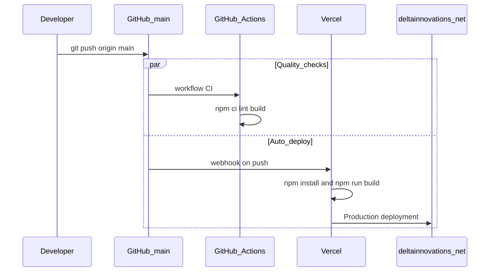

# Deployment

Production hosting uses **Vercel** with **GitHub integration**: every push to `main` triggers an automatic production redeploy to the live site.

## CI/CD workflow (push to live)



| Step | What happens |
|------|----------------|
| 1 | You push commits to `main` on `Delta-Innovations-ORG/delta-innovations-website` |
| 2 | **GitHub Actions** runs [`.github/workflows/ci.yml`](../../.github/workflows/ci.yml) — `npm ci`, `npm run lint`, `npm run build` |
| 3 | **Vercel** receives the push webhook and starts a **Production** deployment |
| 4 | Live site at [deltainnovations.net](https://deltainnovations.net/) updates when the deployment status is **Ready** (~1–3 minutes) |

**Preview deployments:** pushes to other branches (or pull requests) get a unique Vercel preview URL — useful for review before merging to `main`.

**Rollback:** Vercel dashboard → **Deployments** → select a previous successful deployment → **Promote to Production** (no git revert required).

---

## Repository deploy config

[`vercel.json`](../../vercel.json) in the repo root:

| Setting | Value |
|---------|--------|
| Framework | Vite |
| Build | `npm run build` |
| Output | `dist` |
| SPA routing | `vercel.json` `routes`: serve `dist` static files first, then `/index.html` for React Router (`/about`, `/contact`, etc.) |

---

## Vercel dashboard checklist (one-time / verify)

Open your project in [vercel.com/dashboard](https://vercel.com/dashboard):

| Setting | Required value |
|---------|----------------|
| **Connected repository** | `Delta-Innovations-ORG/delta-innovations-website` |
| **Git → Production Branch** | `main` |
| **Deploy on push** | Enabled for production branch (default) |
| **Build command** | `npm run build` (or use `vercel.json`) |
| **Output directory** | `dist` |
| **Install command** | `npm install` |
| **Domains** | `deltainnovations.net` assigned to **Production** |
| **Speed Insights** | Enabled (matches `SpeedInsights` in `src/App.tsx`) |

### Environment variables

Add for **Production** and **Preview** (never commit values to git):

```
VITE_EMAILJS_SERVICE_ID
VITE_EMAILJS_TEMPLATE_ID
VITE_EMAILJS_PUBLIC_KEY
VITE_EMAILJS_PRIVATE_KEY
```

See [ENVIRONMENT_VARIABLES.md](ENVIRONMENT_VARIABLES.md) and [EMAILJS_SETUP.md](EMAILJS_SETUP.md).

After changing env vars on Vercel, trigger **Redeploy** on the latest production deployment.

### Optional: gate production on CI

Vercel → **Settings** → **Deployment Protection** → require GitHub check **CI** to pass before promoting to Production. Enable only after the Actions workflow has run successfully at least once.

---

## Day-to-day developer workflow

1. Develop locally: `npm run dev`
2. Before push (recommended): `npm run lint` and `npm run build`
3. Commit and push to `main`:
   ```bash
   git push origin main
   ```
4. Monitor:
   - **GitHub** → **Actions** → workflow **CI**
   - **Vercel** → **Deployments** → latest **Production** build
5. Verify live site (hard refresh or incognito) when deployment is **Ready**

---

## Initial Vercel setup (if starting fresh)

1. Push this repository to GitHub.
2. Vercel → **Add New Project** → import `delta-innovations-website`.
3. Confirm Vite preset and build settings (or rely on `vercel.json`).
4. Add environment variables (see above).
5. Deploy → assign custom domain `deltainnovations.net`.

---

## Pre-deploy checklist

- [ ] `npm run build` succeeds locally
- [ ] GitHub Actions **CI** passes on `main`
- [ ] No secrets in git (`.env.local` is gitignored)
- [ ] Contact form returns 200 on production `/contact`
- [ ] Direct URLs work on refresh (`/services`, `/privacy`, etc.)
- [ ] Favicon and OG meta in `index.html` are correct

---

## Preview locally

```bash
npm run build
npm run preview
```

Opens the production build locally (Vite preview default port).

---

## Related docs

- [Environment variables](ENVIRONMENT_VARIABLES.md)
- [EmailJS setup](EMAILJS_SETUP.md)
- [Getting started](../03-development/GETTING_STARTED.md)
