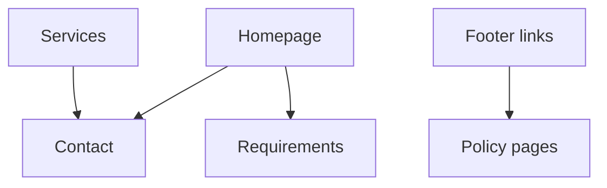

# Site Features

Official marketing website for **Delta Innovations** — modern, animated, and conversion-focused.

## Pages & routes

| Route | Page | Purpose |
|-------|------|---------|
| `/` | Home | Hero, trust bar, services preview, portfolio, how we work, CTA |
| `/about` | About | Company story, mission, values |
| `/services` | Services | Full service catalog |
| `/contact` | Contact | EmailJS-powered inquiry form |
| `/requirements` | Requirements | Client requirements intake |
| `/change-requests` | Change requests | Scope change policy & form |
| `/privacy` | Privacy policy | Legal |
| `/terms` | Terms & conditions | Legal |
| `/refund` | Refund policy | Legal |
| `/cookies` | Cookie policy | Legal |
| `/security` | Security policy | Legal |
| `/code-of-conduct` | Code of conduct | Legal |

## UI & experience highlights

| Feature | Description |
|---------|-------------|
| **3D hero logo** | Tilt, rings, particles, glass panel (`HeroLogoShowcase`) |
| **Custom delta cursor** | Mode-aware cursor: default / interactive / text (desktop) |
| **Portfolio carousel** | 11+ projects with hover effects |
| **Framer Motion** | Scroll reveals, section transitions |
| **Compact footer** | Contact, policies, social — no duplicate CTA |
| **Orbital backgrounds** | Branded mesh gradients |
| **Responsive layout** | Mobile nav, breakpoints from Tailwind |
| **Phone input** | International phone field on contact form |

## Conversion paths

## Tech stack

## Related docs

- [Architecture & routes](ARCHITECTURE_AND_ROUTES.md)  
- [Custom delta cursor](CUSTOM_DELTA_CURSOR.md)  
- [Deployment](DEPLOYMENT.md)
