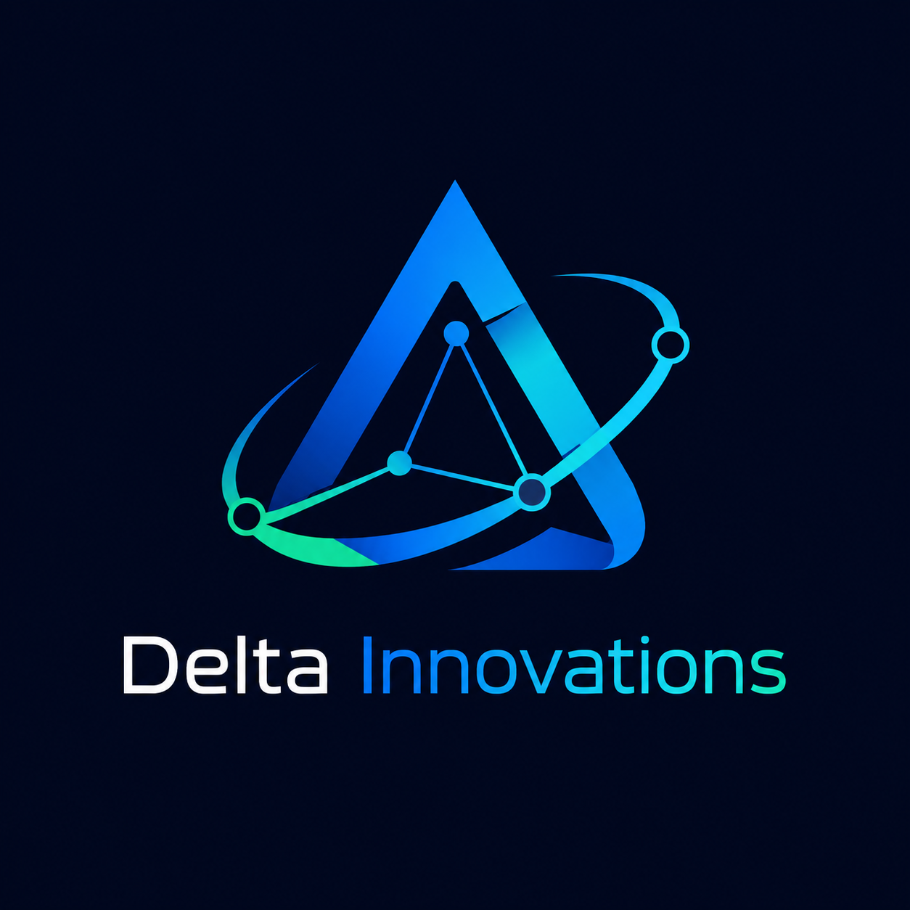
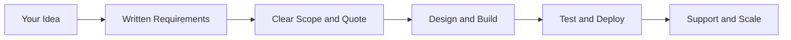

<!-- Animated brand header -->
<svg xmlns="http://www.w3.org/2000/svg" width="100%" height="220" viewBox="0 0 920 220" role="img" aria-label="Delta Innovations">
  <defs>
    <linearGradient id="heroBg" x1="0%" y1="0%" x2="100%" y2="100%">
      <stop offset="0%" stop-color="#050A18"/>
      <stop offset="45%" stop-color="#0F172A"/>
      <stop offset="100%" stop-color="#1E293B"/>
    </linearGradient>
    <linearGradient id="heroGlow" x1="0%" y1="100%" x2="100%" y2="0%">
      <stop offset="0%" stop-color="#22D3EE"/>
      <stop offset="50%" stop-color="#2563EB"/>
      <stop offset="100%" stop-color="#10B981"/>
    </linearGradient>
    <radialGradient id="orb" cx="50%" cy="50%" r="50%">
      <stop offset="0%" stop-color="#22D3EE" stop-opacity="0.35"/>
      <stop offset="100%" stop-color="#22D3EE" stop-opacity="0"/>
    </radialGradient>
  </defs>
  <rect width="920" height="220" rx="16" fill="url(#heroBg)"/>
  <circle cx="460" cy="110" r="120" fill="url(#orb)">
    <animate attributeName="r" values="110;130;110" dur="6s" repeatCount="indefinite"/>
  </circle>
  <circle cx="120" cy="60" r="3" fill="#22D3EE" opacity="0.8">
    <animate attributeName="opacity" values="0.4;1;0.4" dur="3s" repeatCount="indefinite"/>
  </circle>
  <circle cx="800" cy="160" r="2.5" fill="#10B981" opacity="0.8">
    <animate attributeName="opacity" values="0.3;0.9;0.3" dur="4s" repeatCount="indefinite"/>
  </circle>
  <path d="M460 55 L505 145 L415 145 Z" fill="none" stroke="url(#heroGlow)" stroke-width="3" stroke-linejoin="round" opacity="0.9"/>
  <circle cx="460" cy="110" r="78" fill="none" stroke="#38BDF8" stroke-width="1.5" stroke-dasharray="8 10" opacity="0.45">
    <animateTransform attributeName="transform" type="rotate" from="0 460 110" to="360 460 110" dur="18s" repeatCount="indefinite"/>
  </circle>
  <text x="460" y="178" text-anchor="middle" fill="#F8FAFC" font-family="system-ui,Segoe UI,sans-serif" font-size="22" font-weight="700">Delta Innovations</text>
  <text x="460" y="202" text-anchor="middle" fill="#94A3B8" font-family="system-ui,Segoe UI,sans-serif" font-size="13">Engineering digital products with clarity, security, and scale</text>
</svg>

 

  

 

**Your trusted partner for building scalable, secure digital products**

[Website](https://deltainnovations.net/) · [Start a Project](https://deltainnovations.net/contact) · [LinkedIn](https://www.linkedin.com/company/delta-innovations) · [GitHub Org](https://github.com/Delta-Innovations-ORG)

---

## Who we are

**Delta Innovations** is a **Pakistan & Egypt-based digital product engineering company** founded to help startups and growing businesses turn ideas into reliable software — without confusion, scope creep, or security shortcuts.

We are not a random “we do everything” agency. We operate as a **structured engineering team** with written requirements, clear milestones, honest timelines, and transparent delivery.

| | |
|---|---|
| **Founder & CEO** | Suresh Kumar Barach |
| **Headquarters** | Pakistan · Egypt |
| **Focus** | Web · Mobile · AI · Cloud · Data · DevOps · Cybersecurity |
| **Website** | [deltainnovations.net](https://deltainnovations.net/) |

---

## What we do

We design, build, deploy, and scale modern digital products end to end:

| Service | What you get |
|---------|----------------|
| **Web development** | Websites, landing pages, dashboards, web applications |
| **Mobile apps** | Android, iOS, and cross-platform products |
| **Backend & APIs** | REST/GraphQL, authentication, databases, integrations |
| **DevOps & cloud** | Docker, CI/CD, deployment, server setup |
| **AI & machine learning** | Intelligent features, automation, prediction systems |
| **Data analytics** | Dashboards, reports, business insights |
| **Cybersecurity** | Secure development, hardening, security reviews |
| **UI/UX design** | Product design that converts and scales |
| **SaaS & e-commerce** | MVPs, admin portals, subscription products |

> **Blockchain solutions** — coming soon.

---

## Why work with Delta Innovations?

When you partner with us, you get **clarity before code** and **security built in** — not added later.

### Benefits for your business

| Benefit | What it means for you |
|---------|------------------------|
| **No surprise bills** | Scope and pricing are agreed in writing before development starts |
| **Faster decisions** | Clear milestones — you always know what is being built and when |
| **Lower project risk** | Requirements documented → fewer misunderstandings and rework |
| **Production-ready delivery** | Testing, deployment, and DevOps handled professionally |
| **Long-term partnership** | Post-launch support and maintenance as your product grows |
| **Transparent progress** | GitHub-based workflow — traceable, reviewable delivery |
| **Global reach, local presence** | Teams in Pakistan & Egypt with WhatsApp-friendly communication |
| **Security-first mindset** | HTTPS, env-based secrets, hardened auth — not an afterthought |

### What makes us different

- **Written requirements before execution** — we capture goals, features, and constraints on paper first  
- **Clear scope before pricing** — no vague “we’ll figure it out later”  
- **Honest communication** — blockers reported early, timelines you can trust  
- **Practical engineering** — maintainable solutions, not over-engineering  
- **Long-term client trust** — we build products, not one-off tickets  

---

## How we work

| Step | Phase | Outcome |
|:----:|-------|---------|
| **01** | Requirement collection | Your goals and features documented in writing |
| **02** | Scope & proposal | Milestones, timeline, and pricing — agreed upfront |
| **03** | Design & development | UI/UX + engineering with regular updates |
| **04** | Testing & deployment | QA, security checks, production launch |
| **05** | Support & maintenance | Monitoring, fixes, and growth as you scale |

<strong>Why our process protects your investment</strong>

Most failed projects fail because of **unclear scope**, not bad code. Our 5-step process exists so you always know:

- What is included — and what is not  
- When each milestone ships  
- How change requests are handled ([Change Request Policy](https://deltainnovations.net/change-requests))  
- Where your project requirements live ([Requirements Form](https://deltainnovations.net/requirements))  

---

## Mission & vision

> **Mission:** To transform business ideas into reliable digital products through clear requirements, disciplined engineering, secure development, and transparent delivery.

> **Vision:** To become a trusted technology partner for startups and growing businesses across Pakistan, Egypt, and international markets.

---

## Start your project

Ready to build something scalable and secure?

| Action | Link |
|--------|------|
| **Start your project** | [deltainnovations.net/contact](https://deltainnovations.net/contact) |
| **Discuss requirements** | [deltainnovations.net/requirements](https://deltainnovations.net/requirements) |
| **View our services** | [deltainnovations.net/services](https://deltainnovations.net/services) |

---

## Contact us

| Channel | Details |
|---------|---------|
| **Email** | [deltainnovations.co@gmail.com](mailto:deltainnovations.co@gmail.com) |
| **Projects** | [insider.daltainnovations@gmail.com](mailto:insider.daltainnovations@gmail.com) |
| **Pakistan** | +923322795419 (Call / WhatsApp) |
| **Egypt** | +201002637979 (Call) · +201034025254 (WhatsApp) |
| **LinkedIn** | [linkedin.com/company/delta-innovations](https://www.linkedin.com/company/delta-innovations) |
| **GitHub** | [github.com/Delta-Innovations-ORG](https://github.com/Delta-Innovations-ORG) |

---

## This repository

This public repo hosts the **official Delta Innovations marketing website** — a living showcase of our brand, services, portfolio, and client-facing policies.

<strong>Developers & technical documentation</strong>

Setup, architecture, deployment, and EmailJS guides live in the documentation hub:

**[DOCS/README.md](./DOCS/README.md)**

| Guide | Link |
|-------|------|
| Getting started | [DOCS/03-development/GETTING_STARTED.md](./DOCS/03-development/GETTING_STARTED.md) |
| Site features | [DOCS/02-website/SITE_FEATURES.md](./DOCS/02-website/SITE_FEATURES.md) |
| Deployment | [DOCS/02-website/DEPLOYMENT.md](./DOCS/02-website/DEPLOYMENT.md) |

---

## License

**Proprietary — All Rights Reserved.** This repository and all contents are owned by **Delta Innovations**.

Viewing this repo does **not** grant permission to copy, modify, or reuse our code, design, or branding. See [LICENSE](./LICENSE).

Internal team: [CONTRIBUTING.md](./CONTRIBUTING.md) · Security: [SECURITY.md](./SECURITY.md)

---

  

**Delta Innovations**

*Engineering digital products with clarity, security, and scale.*

 

Pakistan · Egypt · © 2025–2026 Delta Innovations. All Rights Reserved.

 

[Website](https://deltainnovations.net/) · [Contact](https://deltainnovations.net/contact) · [Documentation](./DOCS/README.md)

